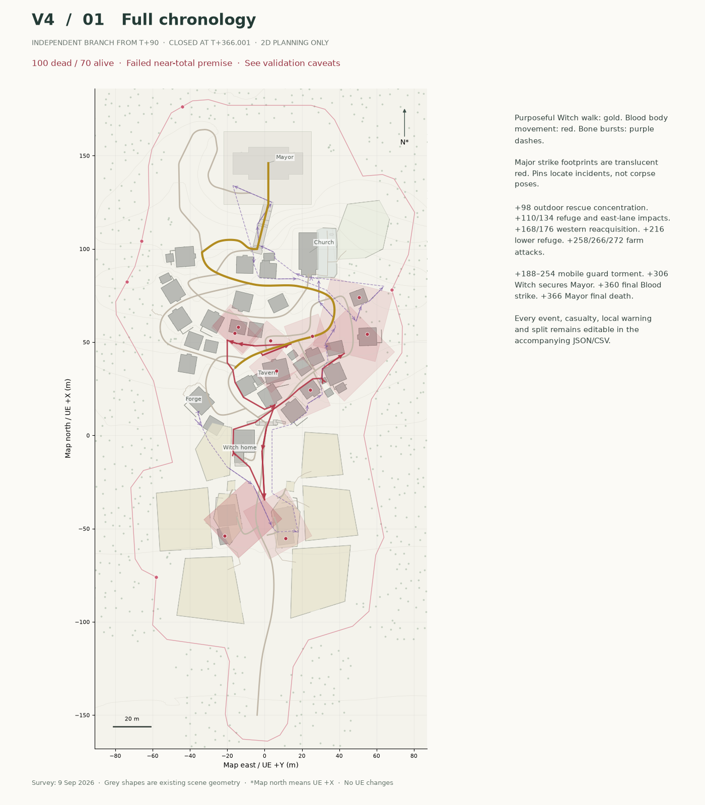

# MASSACRE SIMULATION V4 — INDEPENDENT RE-SIMULATION FROM T+90

**CLOSED: 100 fatalities, 70 survivors, including 10 injured survivors. This experimental pass FAILED the near-total-massacre premise.**

The Witch reaches the Mayor at **T+306.0005**, restrains him for exactly sixty seconds, and personally kills him at **T+366.0005**. The Mayor is the final death. All surviving people remain in the ledger.

Prepared 2026-09-10T11:57:58.144215+00:00. **2D planning only. UE5 is unchanged. These are planning renders from the existing 9 September survey, not new editor screenshots.**

**Material validation failures:** two western field workers were incorrectly pinned in the adjacent pasture at initialization; their later events are provisional. New breaches change cover and reactions but do not rebuild the navigation graph. Conservative first-hit cover handling and group-level interior positions also materially affect survival. This is not an approved reconstruction or a clean proof that the requested V4 rules cannot work.

## Review package

- [All sixteen maps, editable SVGs and combined overview](latest/map/v4/README.md)
- [Full chronology, every cycle, model limitations and survivor explanations](latest/map/v4/MASSACRE_V4_FULL_SIMULATION.md)
- [Frozen simulation](latest/map/v4/v4_simulation.json), [phase ledger](latest/map/v4/action_reaction_phases.jsonl) and [cycle states](latest/map/v4/v4_cycle_states.json)
- [Casualties](latest/map/v4/casualties.csv) and [survivors](latest/map/v4/survivors.csv)
- [Validation](latest/map/v4/v4_validation.json), [metrics](latest/map/v4/v4_metrics.json) and [post-closure comparison](latest/map/v4/v4_comparison.json)
- [Closure digest](latest/map/v4/CLOSURE.json) and [publication manifest](latest/map/v4/review_manifest.json)

## What changed

This is an independent post-T90 branch. V1/V2/V3 post90 material was excluded from decisions and read only after the V4 state digest was sealed. Approved pre90 source files and all earlier branches remain unchanged.

V4 adds distributed search nodes, negative search memory and frontier exploration, longer Blood relocations, cumulative structural cover, consequential Bone attention across multiple districts, a mobile entrance-guard torment sequence, and explicit direct-versus-contributing casualty attribution. Eighteen event-driven checkpoints preserve 109 separate action/reaction phase records on one clock.

Blood travels 276.17 plan metres; Bone travels 539.66. All 41 building/outbuilding footprints receive completed probes, including empty structures. Thirty-six occupied shelters become compromised. Eight secondary search nodes are created. Twenty-three structures finish breached or heavily breached. These are model observations, not verified UE navigation or destruction.

Historical laid traces approach 83.6% of the building-and-yard proxy area. This includes withdrawn branches and measures proximity, not universal sensing. Greater search coverage did not solve slow body access, coarse shelter exposure and the fixed terminal time.

Direct deaths are Blood 76, Bone 18, barrier 5 and Witch 1. Eleven other-killer fatalities have recorded Bone-caused movement context; they are not reassigned to Bone and are not proven counterfactual kills. Independent barrier discoveries remain local.

## Sheets

| Sheet | What it shows |
|---|---|
| [01 Full chronology](latest/map/v4/01_v4_full_chronology.png) | Event geography and chronology |
| [02 Blood body path](latest/map/v4/02_v4_blood_body_path.png) | Executed body travel between concentrations |
| [03 Blood power and accessible resource](latest/map/v4/03_v4_blood_power.png) | Accessible blood resource, reach and search budget |
| [04 Distributed search network](latest/map/v4/04_v4_distributed_network.png) | Four stages of physically laid search traces |
| [05 Search memory and frontier](latest/map/v4/05_v4_search_memory_frontier.png) | Completed probes, negative memory and unresolved frontiers |
| [06 Bone attention and relocation](latest/map/v4/06_v4_bone_attention_route.png) | Separate bursts and consequential attention across districts |
| [07 Bone direct and indirect consequences](latest/map/v4/07_v4_bone_consequences.png) | Direct deaths versus contributing movement chains |
| [08 Son-killer guard sequence](latest/map/v4/08_v4_guard_sequence.png) | Mobile recognition, protected civilians and final precise kill |
| [09 Shelters and civilian movement](latest/map/v4/09_v4_shelter_civilian_movement.png) | Executed civilian movement and shelter pressure |
| [10 Cumulative structural cover](latest/map/v4/10_v4_structural_damage.png) | Intact, damaged, breached and heavily breached cover |
| [11 Barrier contact and local knowledge](latest/map/v4/11_v4_barrier_knowledge.png) | Independent contacts, local witnesses and warning limits |
| [12 Witch: one destination](latest/map/v4/12_v4_witch_route.png) | Purposeful route and recalculated physical timing |
| [13 Mayor: the final minute](latest/map/v4/13_v4_mayor_final_minute.png) | Restraint window, emotional topics and concurrent events |
| [14 Casualty progression](latest/map/v4/14_v4_casualty_progression.png) | Population and direct-killer progression |
| [15 Final aftermath and survivors](latest/map/v4/15_v4_final_aftermath.png) | Every surviving pocket at the terminal clock |
| [16 Environmental storytelling seeds](latest/map/v4/16_v4_environmental_seeds.png) | Causal future evidence, without final assets |

## Preserved references

[Clean base](latest/map/01_village_base_map.png), [blank planning map](latest/map/02_massacre_planning_blank.png), [T0](latest/map/03_T0_normal_activity.png), [approved T90 handoff](latest/map/T1_BONE_COMPLETION.md), [V1](latest/map/MASSACRE_FULL_SIMULATION.md), [V2](latest/map/v2/MASSACRE_V2_FULL_SIMULATION.md) and [V3](latest/map/v3/MASSACRE_V3_FULL_SIMULATION.md) remain unchanged.

The previous review cover is preserved at [the pre-V4 commit](https://github.com/Slav-Storm/UE5-Village-Review/blob/c3d4cf1e7e15fa59999e85e64b04d73d2466be54/REVIEW.md). This additive branch does not replace earlier screenshots; their original capture dates still apply.

**STOPPED at Mayor death. No V5 simulation, UE changes, final damage, corpse placement, VFX, boss or cutscene work is included.**
