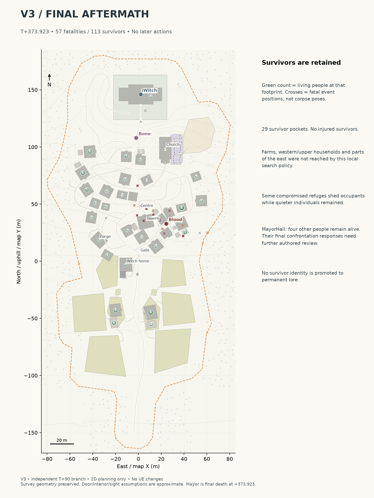

# MASSACRE SIMULATION V3 — INDEPENDENT RE-SIMULATION FROM T+90

**57 fatalities, 113 survivors, no injured survivors. This working implementation FAILED the near-total-massacre premise.**

The Witch reaches the Mayor at **T+313.923**, keeps him alive for sixty seconds, then personally kills him at **T+373.923**. He is the final death. The surviving majority is retained honestly.

Prepared 2026-09-10T10:01:05.297007+00:00. **2D planning only. UE5 is unchanged; no new editor screenshots were captured.**

## Review package

- [All thirteen maps and editable SVGs](latest/map/v3/README.md)
- [Full V3 report: chronology, every cycle, guard sequence, survivor reasons and comparison](latest/map/v3/MASSACRE_V3_FULL_SIMULATION.md)
- [Closed editable simulation](latest/map/v3/v3_simulation.json)
- [Casualty ledger](latest/map/v3/v3_casualties.csv) and [survivors](latest/map/v3/v3_survivors.csv)
- [Source and replay validation](latest/map/v3/v3_validation.json)

## What this branch tests

Only the approved T+0–90 history supplies the starting state. V1/V2 simulation records were excluded from decisions and opened for comparison after V3 closed.

Physical search streams, shelter disagreements/splits, Bone's active attention and local use of visible streams, two civilian opportunists, and a new guard-recognition sequence are added in an independent policy. Thirty-five ACTION/REACTION cycle pairs retain a continuous clock.

Bone recognises the entrance guard at +203 and kills him at +254 after fifty-one seconds. At +223 he injures P12-09, whom the guard is protecting; at +243 he kills that same person while sparing the guard until the end.

Twenty-nine search commitments test thirteen footprints. Nine group splits and fifteen departures explicitly leave compromised shelters. Two boundary deaths follow these departures. The local search policy still fails to reach most surviving households.

## Important limitations

The outcome is a failed model/policy trial, not an approved massacre reconstruction. Search revisits nearby accesses too readily; secondary blood-site branch origins are not exercised; cumulative structural breach is not modelled; repeated Bone shelter pressure remains too weak; estate reactions to Witch securing the Mayor are under-modelled. These issues are documented instead of masked by extra deaths.

Doorways/interior positions, post-opacity sight and most terrain travel are approximations. The raw starting carried-blood store is zero although 4.88 accessible opening units already make him Fed; the initial debug label artefact is explained in the report. Reproducible casualty accounting does not establish realistic behaviour.

## Sheets

| Sheet | What it shows |
|---|---|
| [01 Full chronology](latest/map/v3/01_v3_full_chronology.png) | Overall event geography and terminal condition |
| [02 Blood incidents](latest/map/v3/02_v3_blood_incidents.png) | Executed path and provisional pressure envelopes |
| [03 Blood power](latest/map/v3/03_v3_blood_power.png) | Collected versus remaining sources and growth |
| [04 Search network](latest/map/v3/04_v3_search_network.png) | Four snapshots of physically realised branches |
| [05 Bone incidents](latest/map/v3/05_v3_bone_incidents.png) | Attention, short bursts and consequences |
| [06 Guard sequence](latest/map/v3/06_v3_guard_sequence.png) | Recognition, protected civilian and final precise strike |
| [07 Shelter movement](latest/map/v3/07_v3_shelter_movement.png) | Executed travel, disagreements and refuge departures |
| [08 Barrier knowledge](latest/map/v3/08_v3_barrier_knowledge.png) | Independent contacts, witnesses and warning reports |
| [09 Witch route](latest/map/v3/09_v3_witch_route.png) | Preserved route, timestamps and elevation |
| [10 Mayor final minute](latest/map/v3/10_v3_mayor_minute.png) | Confrontation window, unvoiced beats and contemporaneous strikes |
| [11 Casualty progression](latest/map/v3/11_v3_casualty_progression.png) | Reconciled timeline and attacker totals |
| [12 Final aftermath](latest/map/v3/12_v3_final_aftermath.png) | Every surviving pocket and final actor positions |
| [13 Story seeds](latest/map/v3/13_v3_story_seeds.png) | Causal evidence opportunities, no production assets |

## Preserved references

[Clean base](latest/map/01_village_base_map.png), [blank planning map](latest/map/02_massacre_planning_blank.png), [T0](latest/map/03_T0_normal_activity.png), [approved T90 completion](latest/map/T1_BONE_COMPLETION.md), [V1](latest/map/MASSACRE_FULL_SIMULATION.md) and [V2](latest/map/v2/MASSACRE_V2_FULL_SIMULATION.md) remain unchanged.

The previous review cover is recoverable at [the pre-V3 commit](https://github.com/Slav-Storm/UE5-Village-Review/blob/a8245b86e62415399ed2ddb9ac374cd2a0269ee1/REVIEW.md). Existing UE screenshots retain their original dates; these additions are planning renders.

**STOPPED. No V4, UE implementation, final damage, corpse placement, VFX, bosses or cutscenes begun.**
