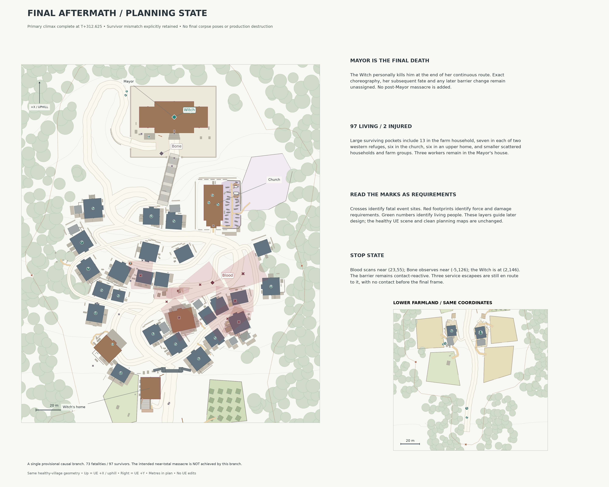
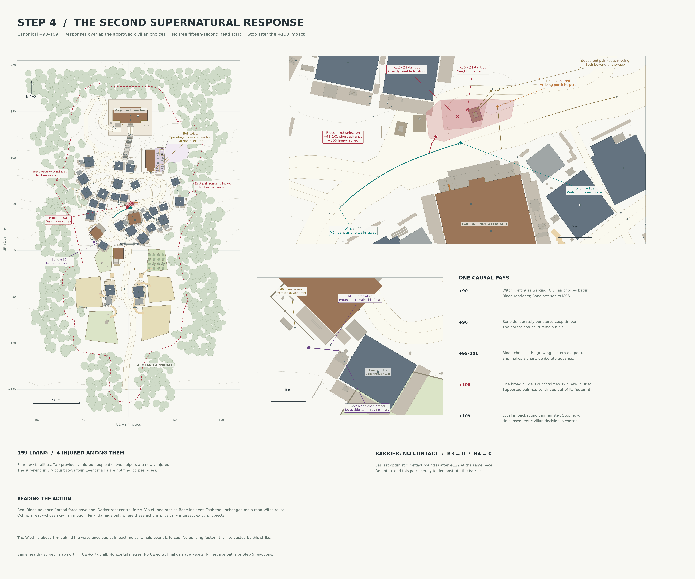
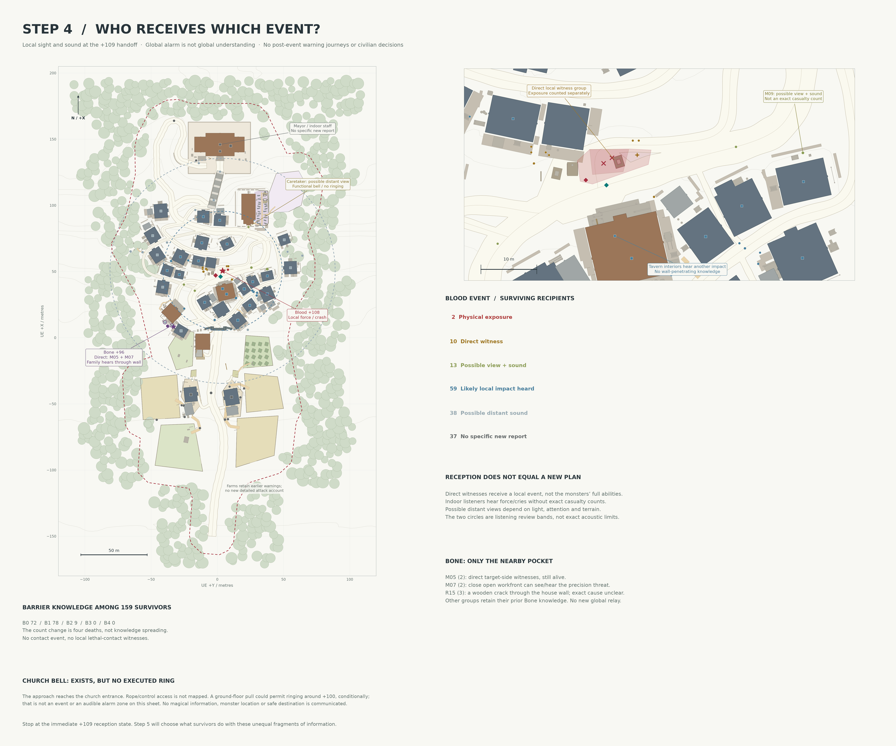
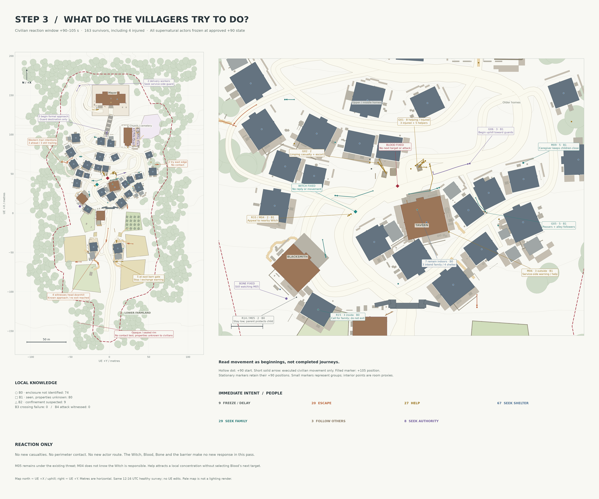
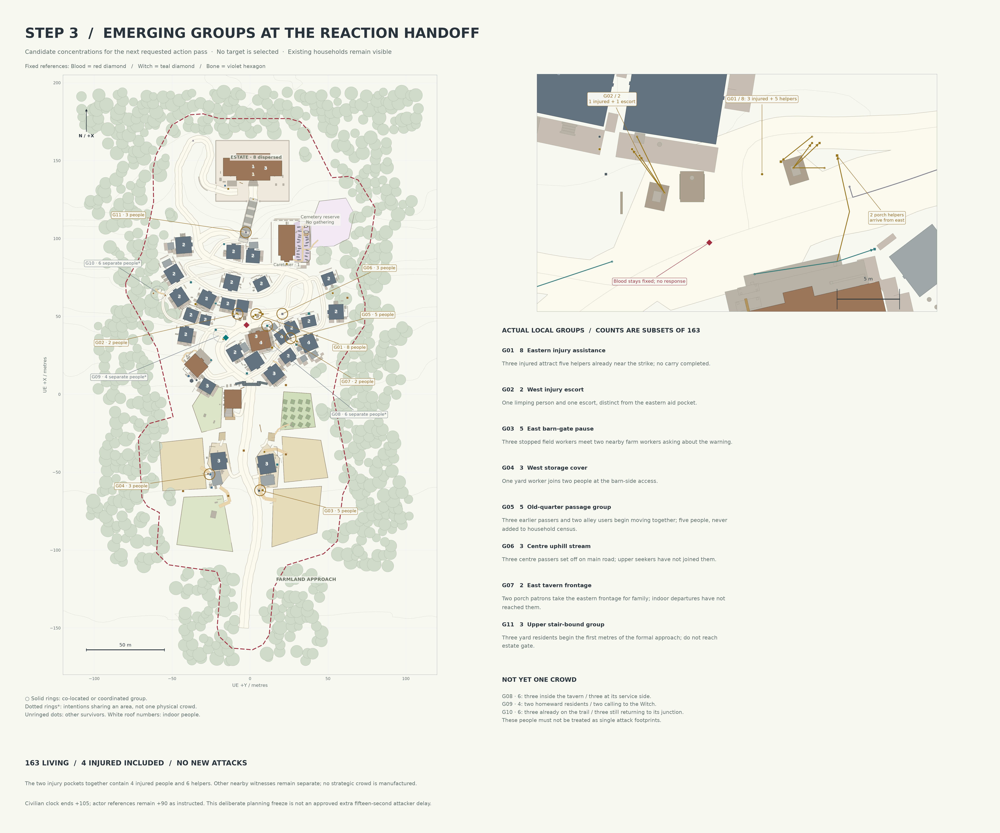
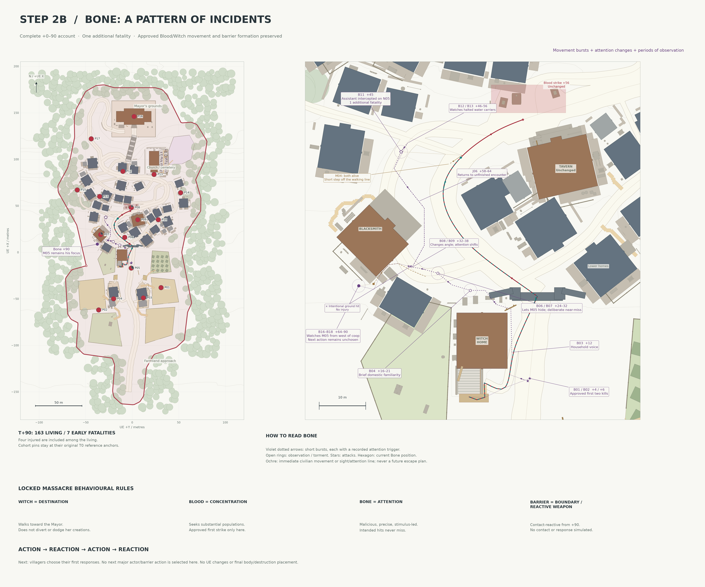
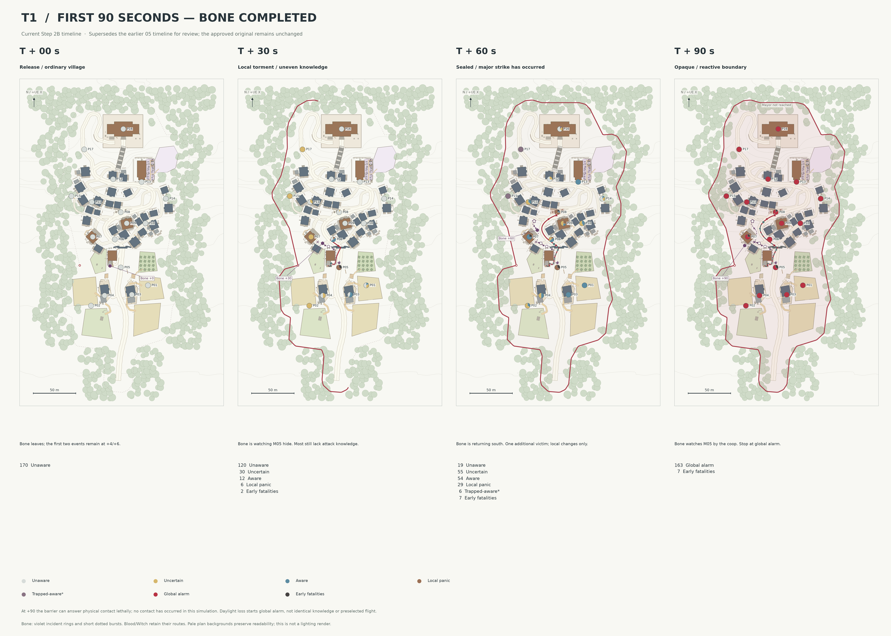
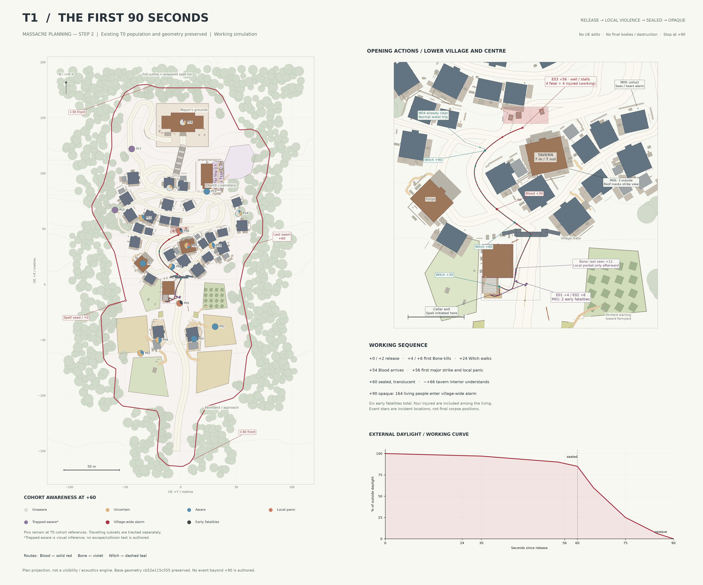
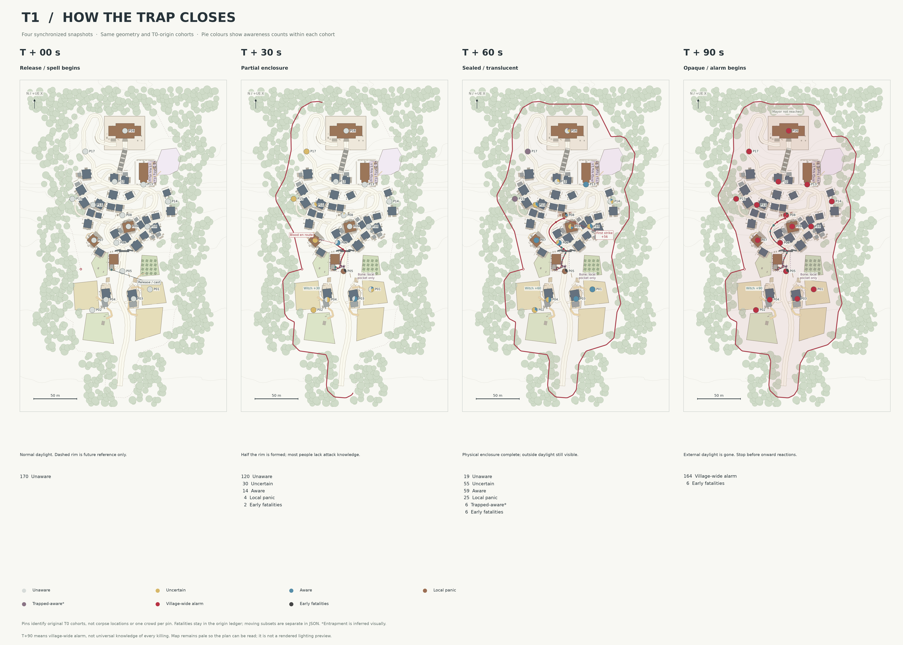

<!-- AUTONOMOUS REVIEW START -->
# AUTONOMOUS MASSACRE SIMULATION — FINAL REVIEW

**The Witch personally kills the Mayor at T+312.625. He is the final death.** This completes the authorized primary-event planning branch. No UE scene changes or new captures were made.

**Result: 73 fatalities and 97 survivors, including two injured survivors, from the original 170. This does not achieve the intended near-total massacre.** The surviving majority is a material narrative mismatch for review. It has been retained explicitly instead of silently killing hidden villagers. These are provisional simulation outcomes, not newly locked survivor lore.

Prepared 2026-09-10T07:14:46.738769+00:00.

## Review package

- [Full chronological summary, event ledger, cycles, guard outcomes and limitations](latest/map/MASSACRE_FULL_SIMULATION.md)
- [Full chronology map](latest/map/13_full_chronology.png)
- [Blood incident / route map](latest/map/14_blood_incidents.png)
- [Bone incident-pattern map](latest/map/15_bone_pattern.png)
- [Witch route and height profile](latest/map/16_witch_route.png)
- [Civilian movement / escape map](latest/map/17_civilian_movements.png)
- [Barrier contact / local knowledge map](latest/map/18_barrier_knowledge.png)
- [Casualty progression map](latest/map/19_casualty_progression.png)
- [Final aftermath planning map](latest/map/20_final_aftermath.png)

All eight final maps have SVG companions. The [unchanged base](latest/map/01_village_base_map.png), [clean massacre canvas](latest/map/02_massacre_planning_blank.png), [T0 activity map](latest/map/03_T0_normal_activity.png) and all earlier approved layers remain available separately.

## What changed since the previous publication

The [early checkpoint](https://github.com/Slav-Storm/UE5-Village-Review/tree/19d427851a7aedd7bd748f581b105c343e889d8d) stopped at +133.5. This review adds the later alternating reactions/actions through the Mayor. There are 25 reaction/action pairs from the +109 handoff, plus the documented +100 bell overlay. The original 50 map/source files and nine published early cycle files remain byte-identical.

The continuation records independent barrier discoveries, rescue and refuge failures, Bone's attention changes, uneven local warnings, individual guard decisions and the continuous Witch walk. Three estate escapees are still approaching the boundary at the terminal frame; their potential +328.48 contact is unexecuted. No post-Mayor deaths, final corpse poses, production destruction, boss, cutscene or rebuilding are authored.

## Editable data and validation

- [Consolidated simulation JSON](latest/map/full_simulation.json)
- [Every original person](latest/map/full_population_ledger.csv) and [survivor ledger](latest/map/full_survivors.csv)
- [Event ledger](latest/map/full_event_ledger.csv), [local knowledge transfers](latest/map/full_knowledge_ledger.csv), [executed versus intended movement](latest/map/full_movement_ledger.csv)
- Separate C##_reaction.json / C##_action.json files under [latest/map](latest/map)
- [Validation record](latest/map/full_validation.json) and [artifact hashes](latest/map/full_manifest.json)

The maps derive from the existing survey geometry. Roof projection, approximate cottage thresholds, interior positions, foot speeds, hearing and visibility remain planning abstractions. Force footprints are provisional exposure/damage requirements. The validation confirms consistency of this branch, not a unique physical prediction or fulfillment of the intended annihilation premise.

Previous review packages remain recoverable through Git history, the unchanged early milestone and the separate cycle/source layers. No UE project files, Blender production files, build products or source assets are uploaded.

**Simulation stopped at the Mayor. The surviving population and unresolved premise now await user review.**
<!-- AUTONOMOUS REVIEW END -->

## Previous Step 4 review (historical)

Action layer authored **2026-09-09T17:51:58.166236+00:00**. Reconciled canonical window **T+90–109 seconds**, overlapping the approved civilian +90–105 movements. **159 survivors, including four injured.** This is a separate 2D planning pass; the UE scene and earlier review captures are unchanged.

**10 — Second action:** full-village context, the eastern assistance pocket, Blood's short advance and single +108 surge, Bone's deliberate +96 coop strike beside M05, and the Witch's uninterrupted road movement. Marks identify immediate exposure and causally intersected proxy objects, not final corpse/debris arrangements.

**11 — Local reception:** direct exposure/witnesses, possible views, likely nearby listeners, possible distant sound and groups without a specific new report. The 45/85 m listening bands are planning guides, not acoustic simulation. Each surviving subgroup retains its prior knowledge unless this pass supplies local evidence.

- [Full action notes, candidate comparison and +109 handoff](latest/map/T3_SECOND_ACTION.md)
- [Editable action JSON](latest/map/t3_second_action.json), [reception CSV](latest/map/t3_reception.csv), [validation manifest](latest/map/t3_manifest.json)
- [Action SVG](latest/map/10_T3_second_action.svg), [reception SVG](latest/map/11_T3_event_reception.svg), [map index and regeneration](latest/map/README.md)
- [Unchanged base](latest/map/01_village_base_map.png), [clean planning canvas](latest/map/02_massacre_planning_blank.png), [T0 activity](latest/map/03_T0_normal_activity.png), [approved T1/Step2B](latest/map/07_T1_bone_timeline.png), [approved Step 3](latest/map/08_T2_civilian_reaction_intentions.png)

**What changed:** Blood selects the growing eastern help pocket after comparing physical concentrations, including six people on the western frontage and separately occupied tavern spaces. Two supported walkers continue out of the attack area. His one second strike causes four fatalities and two new injuries among those still exposed. Two previously injured people die, leaving four injured survivors overall. Bone deliberately hits existing coop timber beside M05; both remain alive. M07 can newly witness the nearby precision threat. The Witch covers 20.9 m along the inherited road and does not stop or divert.

**Continuity:** Step 3's frozen actors were a review convention. Their responses now overlap the original civilian time knots; nobody gains fifteen free seconds or extra movement. The action stops at +109, one second after the +108 impact, before new civilian decisions. The Witch is about one metre behind the wave envelope at impact, so no immunity/melding spectacle is forced.

**Barrier and bell:** no group can reach the rim by this stop at its approved pace; no contact or attack occurs, and **B3/B4 remain zero**. The ordinary functional church bell is now approved. Its rope/control access is unmapped, so no actual ring or bell-based awareness is invented. A ground-floor pull would permit an estimated first ring around +100, conditional on resolving that access; this is not an executed event.

**Review limits:** force severity, practical lighting, character clearance and hearing remain provisional 2D staging. Damage is limited to the coop puncture and market goods/timber physically intersected by these actions. No house footprint is hit. Counts refer to disjoint civilian records, with detailed outcomes in the JSON/CSV; final poses, full escape routes and subsequent reactions remain unassigned.

**Preservation:** all **41 preceding map/source files remain byte-identical**, including clean maps, the empty annotation template, T0, T1, Step2B and Step3. This additive layer replaces no earlier map, so no duplicate archive is needed. **Stop before STEP 5 — SECOND CIVILIAN REACTION.**

## Previous Step 3 review (historical)

Reaction layer authored **2026-09-09T16:10:28.419261+00:00**. Civilian window **T+90–105 seconds**. **163 survivors, including four injured**, with every supernatural actor held at its approved T+90 state. No UE changes or new captures.

- [Reaction notes, local knowledge, complete census and handoff](latest/map/T2_CIVILIAN_REACTIONS.md)
- [Editable reaction JSON](latest/map/t2_civilian_reactions.json), [complete subgroup CSV](latest/map/t2_reactions.csv), [intentions SVG](latest/map/08_T2_civilian_reaction_intentions.svg), [groups SVG](latest/map/09_T2_reaction_groups.svg)
- [Unchanged base](latest/map/01_village_base_map.png), [clean planning canvas](latest/map/02_massacre_planning_blank.png), [T0](latest/map/03_T0_normal_activity.png), [approved T+90 timeline](latest/map/07_T1_bone_timeline.png)

**What changed:** a separate civilian-only layer resolves immediate choices and short beginnings. Twenty people begin escape intentions, eight seek the Mayor/guards, 29 seek family, 67 seek shelter, three follow others, nine freeze/delay, and 27 request/provide help or warnings. The last count includes the four injured. The 79 editable subgroup records partition the original 17 cohorts; they are not extra civilians or households. All surviving named micro-groups keep their exact inherited +90 positions.

**Important reactions:** M05 remains low by the coop with the parent shielding the child. M04 takes a cautious step toward the nearby Witch and appeals to a familiar neighbour; neither knows she is responsible. Six existing helpers gather around the four injured across two adjacent pockets. Tavern reactions split between porch witnesses, receiving staff and indoor occupants. The Mayor asks for information; his guards have only local evidence. No one rings a bell: an architectural bell opening exists, but a working alarm is not confirmed.

**Knowledge:** B0 74; B1 80; B2 9; **B3 0 / B4 0**. All are alarmed; enclosure identification and suspected confinement differ. No one has tested the barrier or witnessed it attack. The nearest short escape movement stops approximately ten metres from it.

**Read the maps:** 08 shows short civilian arrows, stationary intent markers, barrier-knowledge shapes and fixed actor references. 09 separates actual emerging groups from nearby intentions that have not converged. White roof numbers identify indoor populations. No Blood target is selected and Bone does not react to potential stimuli.

**Review assumptions:** the four injured now have a proposed mobility split (two unable to stand, one needing support, one limping). Previously unspecified room/yard positions are refined within existing cohort assignments; they are not new surveyed NPC positions. The new traces clear projected building footprints, but 3D lighting, doors, props and hearing are not validated. The pale maps preserve readability after the simulated blackout.

**Preservation and stop:** all 32 preceding map/source artifacts remain byte-identical. The original empty annotation template, clean maps, T0 and approved T1/Step2B remain intact. No prior map needed replacement or duplicate archiving. **Stop at this first civilian reaction.** The +105 civilian planning snapshot and frozen +90 actor state are an explicit alternating-planning convention, not fifteen seconds of approved attacker inactivity. The next requested action must reconcile timing before advancing actors or resolving contact.

## Previous Step 2B review (historical)

Completion layer authored: **2026-09-09T15:37:33.116940+00:00**. The approved T0 and T1 remain the source reference; this is a separate 2D completion of Bone's first 90 seconds. **No UE scene changes or new captures.**

- [Bone's incident history, locked rules, local awareness changes and +90 stop state](latest/map/T1_BONE_COMPLETION.md)
- [Editable completion overlay](latest/map/bone_completion.json), [SVG](latest/map/06_T1_bone_completed.svg), [behaviour rules](latest/map/massacre_behaviour_rules.json), [current awareness CSV](latest/map/t1b_awareness.csv)
- [Unchanged base map](latest/map/01_village_base_map.png), [clean canvas](latest/map/02_massacre_planning_blank.png), [approved T0 map](latest/map/03_T0_normal_activity.png)

**What changed:** Bone now has a complete incident/observation record through +90, six short attention-driven movement bursts and a definite current target. He torments M05 near its existing home/coop, intercepts the smith's assistant on the approved ordinary walk at +45, briefly watches M04's interrupted water trip, then returns to the earlier hiding encounter. He does not follow Blood's crowd or clear a series of houses. The map uses incident rings and short bursts for Bone while keeping Blood and the Witch as routes.

**Population:** one additional fatality, no additional injuries. Bone has three early fatalities; Blood's four fatalities/four injuries are unchanged. **163 living people remain, including the four injured.** Only M05, M04 and the assistant's movement/awareness records change locally. All other T1 civilian records are inherited.

**Locked rules:** WITCH = DESTINATION; BLOOD = CONCENTRATION; BONE = ATTENTION; BARRIER = BOUNDARY / REACTIVE WEAPON. The same barrier becomes capable of responding lethally to contact at +90. No contact or reactive attack is simulated. The Witch boss introduces this mechanic to the player before the later massacre reconstruction. Those systems are not implemented here.

**Current +90 handoff:** Bone is west of Cottage_04's coop at **(−37.5, +8.8) m**, watching the still-living parent and child at **(−34.3, +9.2) m**. Blood and the Witch retain their approved positions; the barrier is opaque. The next major actor action is unchosen. **Step 3 must first simulate what survivors try to do: ACTION → REACTION → ACTION → REACTION.**

**Review limits:** staging remains a plan projection, not a 3D visibility/acoustics or collision simulation. The short family hide passes a tight gap beside the charcoal bay/forge roof; actual wall/character clearance needs later local validation. Bone's five-second domestic hesitation suggests possible familiarity without resolving his consciousness or inventing history. No final body positions, destruction, assets, full flight routes or post-90 events are created.

**Preservation:** all 23 existing base/T0/T1 source files remain byte-identical. The new **07 timeline is the current revision**; the earlier 05 is retained unchanged, preserving its manifest and review history. No previous map was replaced. The earlier review paragraphs below are historical, including their now-resolved Bone uncertainty. **Stop at T+90.**

## Previous Step 2 / T1 review (historical)

T1 planning layer authored: **2026-09-09T14:39:39.785923+00:00**. Working time remains **late afternoon approaching early evening**. This is a chronological 2D proposal using the approved T0 population and current surveyed geometry; there are **no UE scene edits or new UE captures**.

- [T1 timing, awareness ledger, micro-groups and decisions for review](latest/map/T1_FIRST_90_SECONDS.md)
- [Editable simulation JSON](latest/map/t1_simulation.json), [layered SVG](latest/map/04_T1_first_90_seconds.svg), [awareness table](latest/map/t1_awareness.csv)
- [Unchanged base map](latest/map/01_village_base_map.png), [unchanged clean massacre canvas](latest/map/02_massacre_planning_blank.png), [unchanged T0 activity map](latest/map/03_T0_normal_activity.png)

**What changed:** a separate T1 layer adds opening actor movements, a proposed barrier rim/formation sequence, three early attack events, ordinary civilian movements and geographically staggered awareness. Four snapshots show the transition from normal activity to village-wide alarm. All 17 T0 cohorts and 13 micro-groups are accounted for, with no changed +0 anchors or population counts.

**Working chronology:** Bone's nearest handcart victims are reached at +4/+6; the Witch departs at +24; Blood reaches the outdoor centre at +54 and strikes the well/stall activity at +56; the barrier seals while translucent at +60 and becomes effectively opaque at +90. Six early fatalities leave 164 living people, including four injured. No later fates are assigned.

**Decisions relevant to review:** the approximately 15 m Bone approach makes the first violence earlier than the example timing. Blood needs a purposeful 1.70 m/s stride over the 88.5 m route. M04 and three passers leave the centre on ordinary business beforehand. T0's tavern split is preserved: seven outdoors react earlier, while seven indoors are uncertain at +60 and understand around +66 as window light fails and warnings become recognizable. The Mayor is not reached.

**Unfinished/working assumptions:** the casualty counts, spell rim/crown and light curve require review. Bone's position after his +12 disappearance is bounded to the local cellar/gate-side pocket; his exact hidden motion and +90 pose remain unresolved before Step 3. Sight checks use roof footprints rather than a 3D visibility/acoustics engine. These limits are explicit in the [T1 notes](latest/map/T1_FIRST_90_SECONDS.md#8-spatialnarrative-findings-and-limits).

**Preservation:** 15 base/T0 files were hash-checked byte-identical, including both clean PNG/SVG pairs and the original empty event template. No earlier images were replaced; this is an additive layer and the previous notes remain in Git history. Older perspective captures below keep their original timestamps. **Stop at +90. No Step 3, full escape behavior, onward hunt, final corpse placement or final destruction has been authored.**

## Previous Step 1 / T0 review (historical)

T0 layer authored: **2026-09-09T13:08:04.376738+00:00**. Working time: **late afternoon approaching early evening**; not locked canon.

The supplied design bible v0.1 was read first. This update adds **approximately 170 people in 17 population clusters**, **13 narrative micro-groups**, and **11 ordinary movement flows** to the existing top-down reference. All micro-groups and travellers are included in the cluster count.

- [T0 activity notes and population breakdown](latest/map/T0_ACTIVITY.md)
- [Editable T0 SVG](latest/map/03_T0_normal_activity.svg) and [activity JSON](latest/map/t0_activity.json)
- [Unchanged clean base map](latest/map/01_village_base_map.png)
- [Unchanged clean massacre planning map](latest/map/02_massacre_planning_blank.png)

The centre/junction is the busiest public area; households are increasingly occupied, farm and forest workers are finishing or returning, and the tavern is beginning evening service. The Mayor's eight estate occupants have much more space than the denser households below. One caretaker is at the church's public threshold. No group gathers at the open graves and the burial reserve remains unoccupied.

This is a **2D ordinary-activity proposal**, with no UE scene changes or new UE captures. The 9 September 12:16:22 UTC survey remains the geometric reference. Both clean PNG/SVG pairs and the original geometry, view records, renderer, provenance and empty massacre annotations were hash-checked unchanged. Existing perspective screenshots retain their original timestamps below.

Known limits: counts, time and household allocation remain provisional; indoor activity is conceptual. Roof/canopy projection is not navigation validation. The compressed fields are not a verified year-round food budget. The notes explain the centre's distributed occupancy and the barn approach that stops before roof-obscured storage access.

At that Step 1 checkpoint, Witch/Blood/Bone routes, barrier, attacks, deaths, destruction and aftermath were unauthored. The approved T0 artifacts still contain only ordinary activity. This is an additive layer; existing clean sheets remain available directly and earlier review notes remain in Git history.

## Previous healthy / pre-massacre geometry and perspective review

Review package prepared: **2026-09-09T11:20:02+00:00** (UTC).
Screenshot capture session: **2026-09-09 10:32:11–10:32:26 UTC** / **11:32:11–11:32:26 BST**.
These are the latest saved review captures, repackaged here; repository setup did not change or recapture the UE scene.
Source project checkpoint: `healthy-village-v2`, commit `2bf3d7e27836908c45d5ebebb1158ac527b5739e`.

## New top-down planning maps

Map review added: **2026-09-09T12:37:21+00:00** (UTC). Live scene survey completed **2026-09-09 12:16:22 UTC / 13:16:22 BST**.

The [current village base map and clean massacre planning copy](latest/map/README.md)
are now available as **6000 × 5000 PNGs**, editable SVGs, and separate metric 2D
geometry/landmark data. Both use the exact same surveyed geometry; only the title
differs. All ten event annotation categories remain empty.

[Open the blank massacre planning map](latest/map/02_massacre_planning_blank.png).

This update adds a spatial reference only. The current UE terrain, roads, buildings,
forest, farmland, grave openings and important locations were not changed. The
map derives from a fresh read of 2,209 live actors plus hash-matched mesh sources,
with 5 m contours and enlarged churchyard, mansion-access and cellar panels.
Map north is UE +X (uphill), and scale bars show horizontal metres.

The map is a planimetric projection of visible footprints, including roof overhangs
and tree canopies. It does not establish walkability beneath them. Read the
[map notes](latest/map/README.md) for orientation, scale, derivation, editability
and specific conversion limits. No attack routes, barrier, escape attempts,
destruction or event chronology were plotted.

This is an additive map review: the existing perspective screenshots below remain
unchanged, with their original timestamps. No earlier image set was replaced;
the preceding notes remain recoverable in Git history.

## Review intent

Evaluate the functioning poor rural village shortly before the massacre, after the witch has manually exhumed her lover and son. This is a spatial and environmental-storytelling greybox. No massacre, corpses, gore, supernatural structures, final assets or burial progression are present.

## What changed

The perspective screenshot set was the first review published here. Compared with the earlier healthy village pass:

- Refined the existing public churchyard with twenty older graves, varied markers and family groupings; opened a blocked public entrance.
- Added the adult lover's and child's empty, manually reopened graves. Their original markers remain, with displaced soil, lifted boards and a hand spade. Reserved an undisturbed potential third plot beside them.
- Reserved approximately 699 m² of adjacent empty meadow for future burials.
- Added a small set of caretaker/household objects, a family seat, a wooden toy and mending space; clarified the witch's external cellar landing, handrail and open door.
- Preserved the previous 165 household proxies, main roads, building distribution, farmland, forest, mansion position, staircase/cart access and original title-view composition.

## Reading these images

- Images use the temporary **+2 EV inspection exposure** for readability. The saved scene retains its original exposure; this is not a final lighting pass.
- Screenshots are proportionally reduced to **1600 px wide PNGs** for a lightweight review package. Original full-resolution captures remain with the local project. Nothing is cropped or generated.
- Player-height views use an editor camera at approximately 180 cm. The aerial, grave close-up, house overview and meadow overview are raised inspection views. Camera poses are recorded in [latest/manifest.json](latest/manifest.json).
- The hill profile is preserved except for the two actual grave openings, affecting about 5.12 m². Ordinary buildings remain in their accepted locations.
- Grey blocks, low-poly soil and plain markers establish scale and function; they are not production art.

## Known issues and unfinished areas

- Gameplay walking/collision/navigation has not been tested by this camera review. Visual access does not yet prove playable traversal.
- The empty burial meadow remains sloping. A provisional 90–120 future burials would require later small contour terraces and paths; capacity is not a finished grave layout.
- Marker weathering/age is represented through shape, lean and placement only. All graves and props need later production art.
- The cellar is approximate underground space. Its final Settings environment, narrative contents and movement integration remain unfinished.
- The original lighting is darker than these inspection images. Final lighting, materials, NPC activity, destruction and progression remain future work.

## Combined overview

The contact sheet retains its earlier seven-view numbering. Use the headings and filenames below as the stable repository view identifiers.

## Individual views

### 01. Aerial overview

The retained uphill village, lower farmland, dense forest enclosure and elevated Mayor's property.

### 02. Title-screen approach

The established approach camera: road and farmland in front, village gate and climbing settlement beyond, mansion on the summit.

### 03. Village centre

Player-height view of the irregular social junction and its existing market, noticeboard, well and tavern surroundings.

### 04. Church and cemetery

Player-height view of the small public church and twenty older graves, with varied markers and family groupings.

### 05. Witch's home and cellar

Raised overview of the ordinary family house, domestic yard and external side-cellar entrance with supported landing and handrail.

### 06. Mayor's staircase approach

The formal stair flights, landings, boundary and entrance to the private grounds. View 10 shows the separate cart access.

### 07. The two disturbed graves

Close overview: adult lover on the right, child on the left. Both are empty and reopened from above, with original markers, spoil and lifted boards.

### 08. Future burial land

The established churchyard and approximately 699 square metres of adjacent empty meadow reserved for later burial progression.

### 09. Ordinary family yard

Herb/remedy work, a family table, child stool, adult seat and firewood establish a domestic family home.

### 10. Mayor's cart/service route

Functional cart access and service area supporting the elevated property separately from the ceremonial staircase.

### 11. Cellar threshold

Player-height view from the new side landing into the existing cellar stair and underground space.

