# MASSACRE PLANNING — STEP 1 / T0 NORMAL VILLAGE

T0 layer authored: **2026-09-09T13:08:04.376738+00:00**. Working time: **late afternoon approaching early evening**; not locked canon.

The supplied design bible v0.1 was read first. This update adds **approximately 170 people in 17 population clusters**, **13 narrative micro-groups**, and **11 ordinary movement flows** to the existing top-down reference. All micro-groups and travellers are included in the cluster count.

- [T0 activity notes and population breakdown](latest/map/T0_ACTIVITY.md)
- [Editable T0 SVG](latest/map/03_T0_normal_activity.svg) and [activity JSON](latest/map/t0_activity.json)
- [Unchanged clean base map](latest/map/01_village_base_map.png)
- [Unchanged clean massacre planning map](latest/map/02_massacre_planning_blank.png)

The centre/junction is the busiest public area; households are increasingly occupied, farm and forest workers are finishing or returning, and the tavern is beginning evening service. The Mayor's eight estate occupants have much more space than the denser households below. One caretaker is at the church's public threshold. No group gathers at the open graves and the burial reserve remains unoccupied.

This is a **2D ordinary-activity proposal**, with no UE scene changes or new UE captures. The 9 September 12:16:22 UTC survey remains the geometric reference. Both clean PNG/SVG pairs and the original geometry, view records, renderer, provenance and empty massacre annotations were hash-checked unchanged. Existing perspective screenshots retain their original timestamps below.

Known limits: counts, time and household allocation remain provisional; indoor activity is conceptual. Roof/canopy projection is not navigation validation. The compressed fields are not a verified year-round food budget. The notes explain the centre's distributed occupancy and the barn approach that stops before roof-obscured storage access.

All Witch/Blood/Bone routes, barrier, attacks, deaths, destruction and aftermath remain unauthored. **Stop at Step 1 / T0 for review.** This is an additive layer; existing clean sheets remain available directly and earlier review notes remain in Git history.

## Previous healthy / pre-massacre geometry and perspective review

Review package prepared: **2026-09-09T11:20:02+00:00** (UTC).
Screenshot capture session: **2026-09-09 10:32:11–10:32:26 UTC** / **11:32:11–11:32:26 BST**.
These are the latest saved review captures, repackaged here; repository setup did not change or recapture the UE scene.
Source project checkpoint: `healthy-village-v2`, commit `2bf3d7e27836908c45d5ebebb1158ac527b5739e`.

## New top-down planning maps

Map review added: **2026-09-09T12:37:21+00:00** (UTC). Live scene survey completed **2026-09-09 12:16:22 UTC / 13:16:22 BST**.

The [current village base map and clean massacre planning copy](latest/map/README.md)
are now available as **6000 × 5000 PNGs**, editable SVGs, and separate metric 2D
geometry/landmark data. Both use the exact same surveyed geometry; only the title
differs. All ten event annotation categories remain empty.

[Open the blank massacre planning map](latest/map/02_massacre_planning_blank.png).

This update adds a spatial reference only. The current UE terrain, roads, buildings,
forest, farmland, grave openings and important locations were not changed. The
map derives from a fresh read of 2,209 live actors plus hash-matched mesh sources,
with 5 m contours and enlarged churchyard, mansion-access and cellar panels.
Map north is UE +X (uphill), and scale bars show horizontal metres.

The map is a planimetric projection of visible footprints, including roof overhangs
and tree canopies. It does not establish walkability beneath them. Read the
[map notes](latest/map/README.md) for orientation, scale, derivation, editability
and specific conversion limits. No attack routes, barrier, escape attempts,
destruction or event chronology were plotted.

This is an additive map review: the existing perspective screenshots below remain
unchanged, with their original timestamps. No earlier image set was replaced;
the preceding notes remain recoverable in Git history.

## Review intent

Evaluate the functioning poor rural village shortly before the massacre, after the witch has manually exhumed her lover and son. This is a spatial and environmental-storytelling greybox. No massacre, corpses, gore, supernatural structures, final assets or burial progression are present.

## What changed

The perspective screenshot set was the first review published here. Compared with the earlier healthy village pass:

- Refined the existing public churchyard with twenty older graves, varied markers and family groupings; opened a blocked public entrance.
- Added the adult lover's and child's empty, manually reopened graves. Their original markers remain, with displaced soil, lifted boards and a hand spade. Reserved an undisturbed potential third plot beside them.
- Reserved approximately 699 m² of adjacent empty meadow for future burials.
- Added a small set of caretaker/household objects, a family seat, a wooden toy and mending space; clarified the witch's external cellar landing, handrail and open door.
- Preserved the previous 165 household proxies, main roads, building distribution, farmland, forest, mansion position, staircase/cart access and original title-view composition.

## Reading these images

- Images use the temporary **+2 EV inspection exposure** for readability. The saved scene retains its original exposure; this is not a final lighting pass.
- Screenshots are proportionally reduced to **1600 px wide PNGs** for a lightweight review package. Original full-resolution captures remain with the local project. Nothing is cropped or generated.
- Player-height views use an editor camera at approximately 180 cm. The aerial, grave close-up, house overview and meadow overview are raised inspection views. Camera poses are recorded in [latest/manifest.json](latest/manifest.json).
- The hill profile is preserved except for the two actual grave openings, affecting about 5.12 m². Ordinary buildings remain in their accepted locations.
- Grey blocks, low-poly soil and plain markers establish scale and function; they are not production art.

## Known issues and unfinished areas

- Gameplay walking/collision/navigation has not been tested by this camera review. Visual access does not yet prove playable traversal.
- The empty burial meadow remains sloping. A provisional 90–120 future burials would require later small contour terraces and paths; capacity is not a finished grave layout.
- Marker weathering/age is represented through shape, lean and placement only. All graves and props need later production art.
- The cellar is approximate underground space. Its final Settings environment, narrative contents and movement integration remain unfinished.
- The original lighting is darker than these inspection images. Final lighting, materials, NPC activity, destruction and progression remain future work.

## Combined overview

The contact sheet retains its earlier seven-view numbering. Use the headings and filenames below as the stable repository view identifiers.

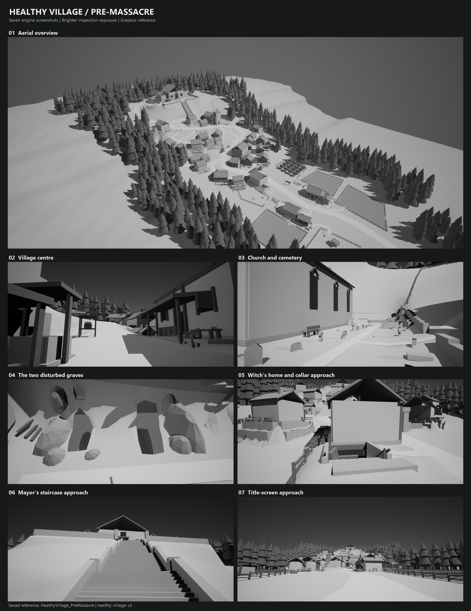

## Individual views

### 01. Aerial overview

The retained uphill village, lower farmland, dense forest enclosure and elevated Mayor's property.

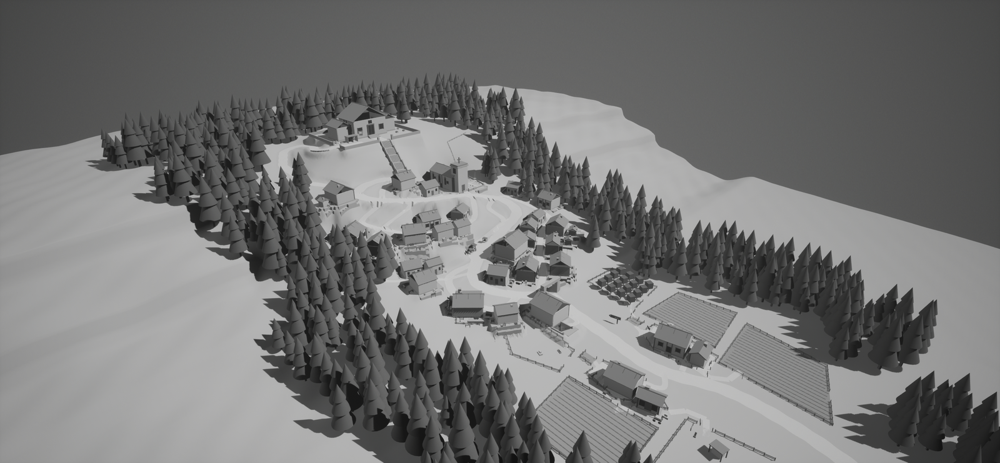

### 02. Title-screen approach

The established approach camera: road and farmland in front, village gate and climbing settlement beyond, mansion on the summit.

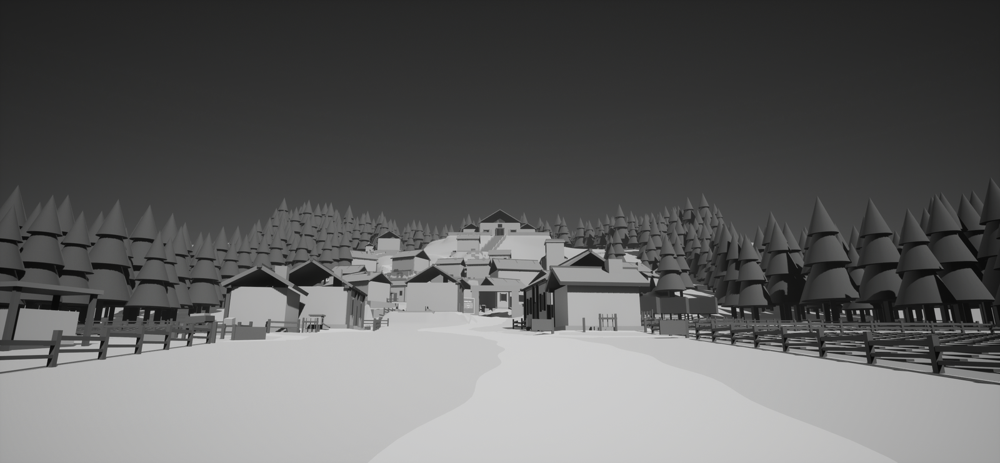

### 03. Village centre

Player-height view of the irregular social junction and its existing market, noticeboard, well and tavern surroundings.

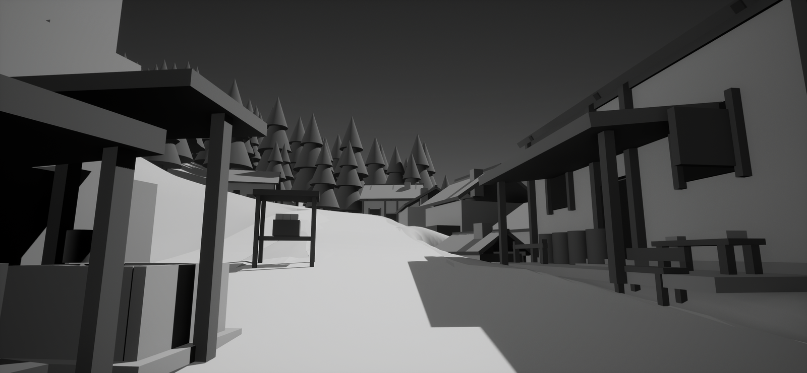

### 04. Church and cemetery

Player-height view of the small public church and twenty older graves, with varied markers and family groupings.

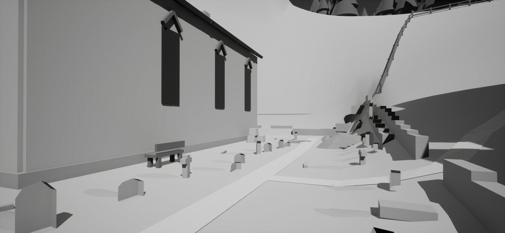

### 05. Witch's home and cellar

Raised overview of the ordinary family house, domestic yard and external side-cellar entrance with supported landing and handrail.

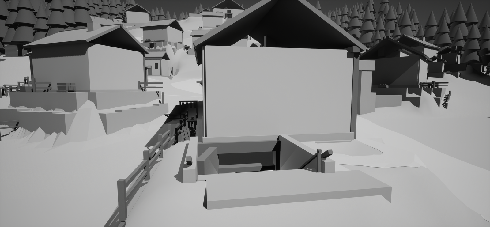

### 06. Mayor's staircase approach

The formal stair flights, landings, boundary and entrance to the private grounds. View 10 shows the separate cart access.

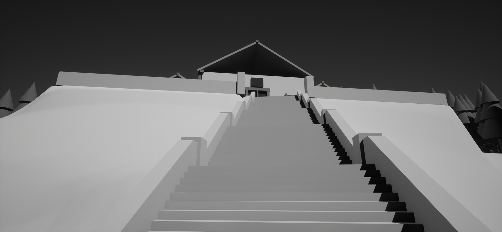

### 07. The two disturbed graves

Close overview: adult lover on the right, child on the left. Both are empty and reopened from above, with original markers, spoil and lifted boards.

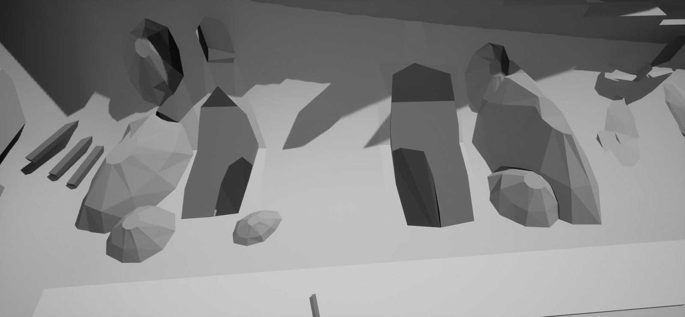

### 08. Future burial land

The established churchyard and approximately 699 square metres of adjacent empty meadow reserved for later burial progression.

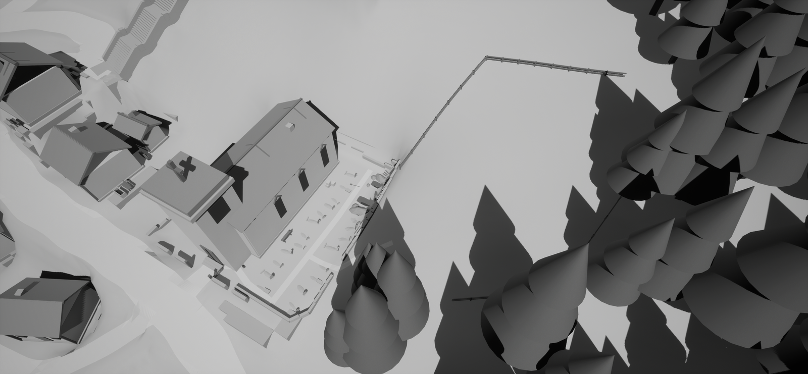

### 09. Ordinary family yard

Herb/remedy work, a family table, child stool, adult seat and firewood establish a domestic family home.

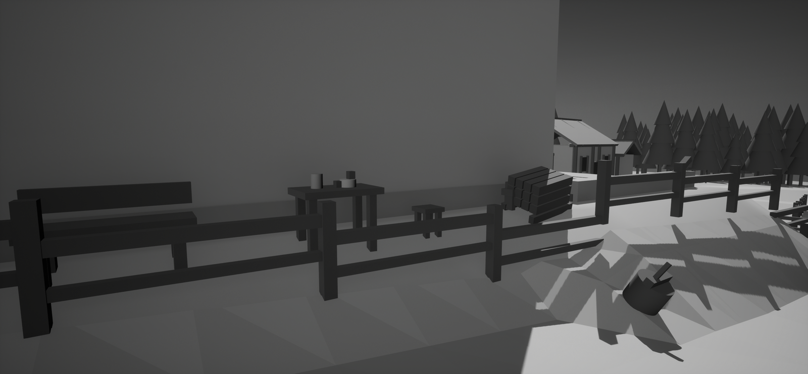

### 10. Mayor's cart/service route

Functional cart access and service area supporting the elevated property separately from the ceremonial staircase.

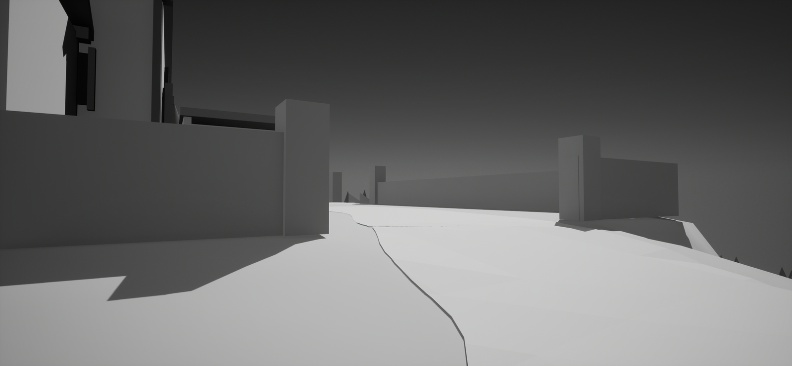

### 11. Cellar threshold

Player-height view from the new side landing into the existing cellar stair and underground space.

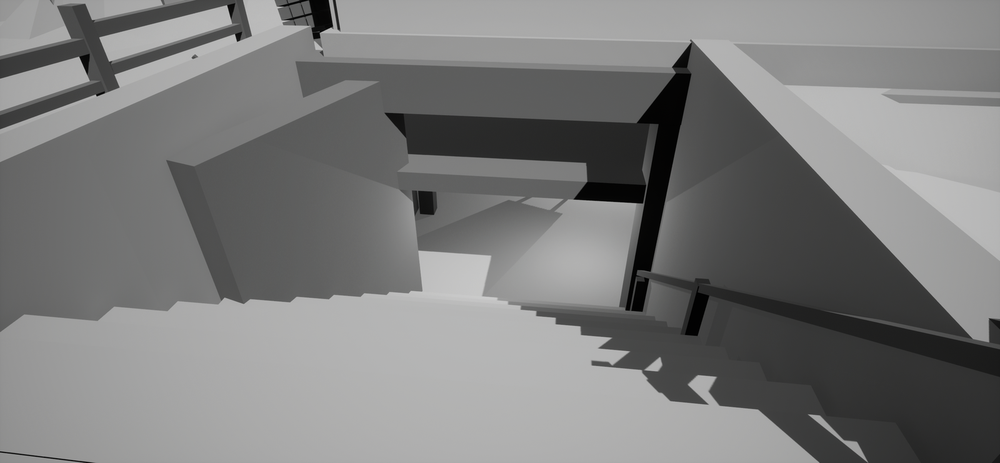
