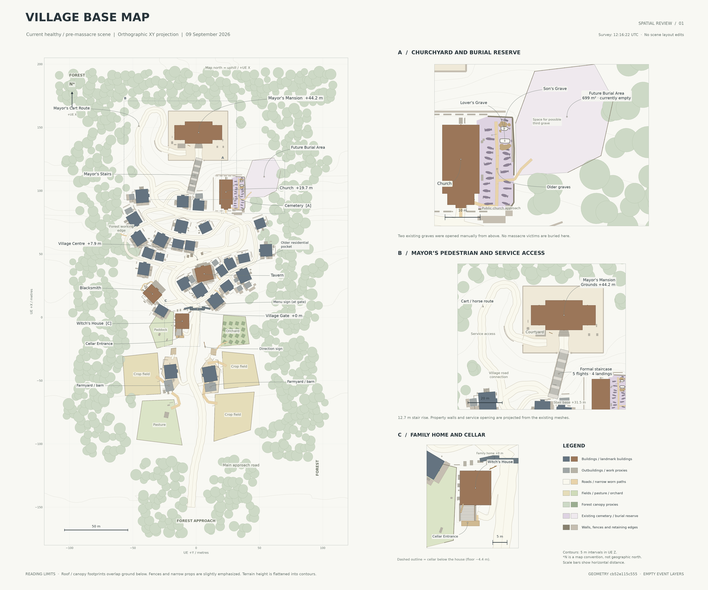

# Current review: Step 3 / first civilian reaction

The current planning handoff is the **+90–105 civilian reaction**, with supernatural actors held at +90. Start with [T2_CIVILIAN_REACTIONS.md](T2_CIVILIAN_REACTIONS.md), [08 intentions](08_T2_civilian_reaction_intentions.png) and [09 emerging groups](09_T2_reaction_groups.png).

Edit [t2_civilian_reactions.json](t2_civilian_reactions.json) and run `python render_t2.py .` here to regenerate only the new PNG/SVG pair, derived notes, complete CSV and validation manifest. The JSON includes timed civilian beginnings, knowledge, injuries/helpers, disjoint cohort membership, actual versus merely converging groups, and the frozen actor handoff. No future actor response is selected.

Overlay order: `t0_activity.json` → `t1_simulation.json` → `bone_completion.json` → `t2_civilian_reactions.json`. Keep `massacre_behaviour_rules.json` as the locked rule reference. Earlier images/data are immutable historical layers, not stale files to overwrite. All 32 prior source artifacts are preserved exactly. No UE scene changes are implied.

Orientation remains up = UE +X/uphill, right = UE +Y; coordinates and scale bars are horizontal metres. The same healthy survey and its 2D projection limits apply. No new geography or final lighting is represented. Stop here for review.

## Previous map documentation

# Current village planning maps

## Current review — Step 2B: Bone completed

- [06 — Completed Bone incident pattern](06_T1_bone_completed.png), 6000 × 5000.
- [07 — Updated four-snapshot timeline](07_T1_bone_timeline.png), 7000 × 5000. This is the current timeline; the earlier 05 sheet remains preserved below.
- [Complete incident history, locked rules and +90 handoff](T1_BONE_COMPLETION.md).
- [Editable completion overlay](bone_completion.json), [SVG](06_T1_bone_completed.svg), [locked rules](massacre_behaviour_rules.json), [current awareness CSV](t1b_awareness.csv), `render_bone_completion.py`, `t1b_manifest.json`.

Bone's previously unresolved interval is now accounted for through +90. One additional fatality leaves 163 survivors, including four injured. All 23 prior base/T0/T1 files remain unchanged. Apply the completion overlay after the original T1 data; use its explicit local overrides and resolved handoff. Blood, the Witch and barrier formation remain inherited. No UE edits or post-90 civilian reaction occurred.

## Preserved earlier T1 first 90 seconds — Step 2

- [Opening simulation](04_T1_first_90_seconds.png) — 6000 × 5000; routes, early events, +60 awareness and the daylight curve.
- [Four time slices](05_T1_timeline.png) — 7000 × 5000; +0 / +30 / +60 / +90.
- [Timing, population ledger, all micro-groups and review assumptions](T1_FIRST_90_SECONDS.md).
- [Separate editable T1 JSON](t1_simulation.json), [SVG](04_T1_first_90_seconds.svg), [awareness CSV](t1_awareness.csv), `render_t1.py` and `t1_manifest.json`.

The T1 proposal stops at +90 as the barrier becomes opaque and village-wide alarm begins. Working counts are six early fatalities and 164 living people, including four injured. Bone's exact hidden movement after +12 remains a bounded review issue; it is not an authored onward hunt. No UE scene change, final corpse/debris layout or post-90 event was made.

All 15 existing base/T0 files below remain byte-identical. The original clean massacre template remains empty; **T1 events exist only in the dedicated T1 layer**. Earlier statements about no events refer to the clean/T0 artifacts, not to this new simulation.

## T0 ordinary activity — Step 1

[Review the T0 activity map](03_T0_normal_activity.png) and [short activity notes](T0_ACTIVITY.md).
The separate layer allocates about 170 ordinary residents across 17 clusters,
with 13 micro-groups and 11 daily movement flows. Late afternoon/early evening is
a working choice. No UE edits or future massacre events were made.

Use [t0_activity.json](t0_activity.json), [editable T0 SVG](03_T0_normal_activity.svg)
and `render_t0.py` for this layer. `t0_manifest.json` records its checks and frames.
Both clean maps and their base geometry remain byte-for-byte unchanged. The
earlier derivation and orientation notes below continue to apply.

Live UE survey completed **2026-09-09 12:16:22 UTC / 13:16:22 BST**.
Source: the currently open `/Game/Levels/TitleScreen` scene, at healthy checkpoint
`2bf3d7e27836908c45d5ebebb1158ac527b5739e` (`healthy-village-v2`).

This is a spatial reference of the existing healthy / pre-massacre village. The UE
layout was not edited. The clean base and blank canvas contain no massacre movements, escape attempts,
barrier, attacks, damage, event nodes or chronology. See the separate T1 layer above.

## Review the two sheets

- [Village Base Map — 6000 × 5000 PNG](01_village_base_map.png)
- [Village Massacre Planning Map — clean 6000 × 5000 PNG](02_massacre_planning_blank.png)
- [Editable base SVG](01_village_base_map.svg)
- [Editable blank planning SVG](02_massacre_planning_blank.svg)

The planning copy has identical geometry, labels, insets, scale and framing. Only
its title differs. The full image below the title was compared pixel for pixel.
Use the full-resolution files to inspect narrow passages and the grave details.

## Orientation and scale

The sheet is a true planimetric XY projection. **Up / map north is UE +X; right is
UE +Y.** This keeps the farmland approach below the uphill village and mansion.
The north marker is an explicit working convention, not a claim of geographic north.

Map coordinates are metres: `map_x = UE_Y / 100`, `map_y = UE_X / 100`.
To return a map point to UE centimetres: `UE_X = map_y * 100`,
`UE_Y = map_x * 100`. Height is UE Z, with gate ground approximately zero.

The overview spans **240 m across by 385 m along the hill**, including the current
forest envelope and the approach through woodland. Scale bars show horizontal
distance: 50 m on the overview, 10 m in A, 20 m in B, and 5 m in C. Resizing the
page changes print scale; use the bars rather than assuming a fixed paper scale.

Five-metre terrain contours show the hill and terraces. Reference elevations are
about +7.9 m at the centre, +19.7 m at the church, +31.5 m at the staircase foot,
and +44.2 m at the mansion grounds. The existing main road from gate to stair foot
measures approximately 222.7 m horizontally; the cart branch is 116.9 m. The
staircase rises 12.7 m through 72 risers, five flights and four landings.

## How this was derived

1. Read all **2,209 live editor actors** through the established local Unreal MCP
   connection: actor transforms, labels, bounds, tags, visible mesh references and
   component transforms. No actor, terrain, asset, camera or road was moved.
2. Project visible primitive geometry and current imported mesh sources into the
   map plane. The 61 imported source meshes match their live asset hash suffixes;
   their local bounds agree with Unreal within **0.001 cm**. Imported OBJ Y-axis
   conversion was reversed before applying the live transforms.
3. Union projected building parts while retaining real orientation and roof
   overhangs. The Mayor's two existing wings are grouped with his main house.
   Preserve the actual street, field, fence, retaining-wall, staircase, grave and
   secondary path footprints. No settlement generator or scene sync was run.
4. Use the existing registries for names, field-use categories, the civic-space
   tint, reserved burial land, grave identities and existing road/path centreline
   information. These are retained design records, not newly planned routes.
5. Derive contours from the current terrain mesh with its two existing local
   grave openings. Add simple labels, a legend, and detail panels without changing
   the shared geometry.

The projection includes 31 main buildings, 10 older outbuildings, 10 agricultural
plots, 802 forest tree proxies, 20 existing route records, and 12 later narrow
path records. Household/work objects are shown as subdued proxy footprints.
The existing graveyard contains 20 older graves and the two empty story graves;
the approximately 699 m² burial reserve has no new graves.

## Labelled locations

Village Gate, Village Centre, Tavern, Blacksmith, Witch's House, Cellar Entrance,
Church, Cemetery, Lover's Grave, Son's Grave, Future Burial Area, Mayor's Stairs,
Mayor's Cart Route and Mayor's Mansion are labelled. Additional descriptive
labels identify existing farmyards/barns, field uses, the older residential
pocket, forest working edge, menu sign and direction sign.

- **A:** Church, old graves, the two manually exhumed graves, unmarked possible
  third-grave space, and the existing burial reserve.
- **B:** Mansion, grounds, formal stair flights, courtyard and separate cart route.
- **C:** Family house, existing cellar landing/stairs and underground floor outline.

## Editing and regeneration

- `map_data.json` contains separately identified 2D features, landmark points,
  existing route centreline/width/height records and the shared geometry hash.
  It uses **local game metres, not latitude/longitude**.
- `map_views.json` records each panel's world extent and its pixel/SVG frame.
  For a frame `[left, top, width, height]` and world extent
  `[xmin, ymin, xmax, ymax]`, convert a point with
  `px = left + (x-xmin)/(xmax-xmin)*width` and
  `py = top + (ymax-y)/(ymax-ymin)*height`.
- Both SVG files contain editable base geometry and ten named, **empty** event
  layers for later work. Keep annotations separate from the existing base.
- `massacre_annotations.json` reserves the same ten empty categories in local
  metric coordinates. It contains no proposed routes or events.
- `provenance.json` records source hashes and the projection audit.
- `render_map.py` regenerates both sheets from this saved 2D survey using Python,
  NumPy, Matplotlib, Shapely and Pillow. Run `python render_map.py .` from this
  directory. It does not connect to or modify UE5. This renderer reproduces the
  clean base; later event annotation rendering remains to be authored.

If the UE layout changes, make a fresh read-only live survey and update the 2D
data/provenance before regenerating. Re-rendering the current JSON alone does not
refresh it from Unreal. The live-read and derivation scripts are retained with
the local working task for that purpose. No UE packages or 3D source meshes are
included in this review repository.

## Reading limits

- This is a top-down projection, not a navigation mesh or a playable floor plan.
  Roofs/eaves and tree canopies overlap space beneath them. The canopy boundary
  reflects actual proxy positions; it does not prove whether a person can pass.
- Building terraces and retaining edges are visible, but 2D contours cannot fully
  describe steep banks, undercuts, wall heights or vertical occlusion. Narrow
  passages need later player-height checks before authoring specific events.
- Native round proxies are approximated by 32-sided projected silhouettes.
  Imported mesh outlines are simplified by about 5 mm for compactness. Thin
  outlines are emphasized for readability. Plough furrows and hidden editor
  helpers are omitted; field boundaries, farm access and household structures remain.
- The old cemetery's pale area tint joins existing wall traces and the church-side
  edge. It is a reading aid; the projected wall geometry is the authoritative edge.
  The burial reserve remains sloping, with its existing trees; no burial terraces
  or progression plots have been created.
- The dashed cellar outline shows the existing floor below the house, at about
  −4.4 m. Underground contents and roof-obscured access are not a complete interior plan.
- Survey colours indicate categories only. They are not new UE materials or art direction.

The approximately 7 MB map bundle is additive to the earlier screenshot review.
Its PNGs retain the requested high resolution, and every individual file is below
5 MB. Earlier perspective screenshots keep their original capture dates.

**Review this base before designing the massacre.**
