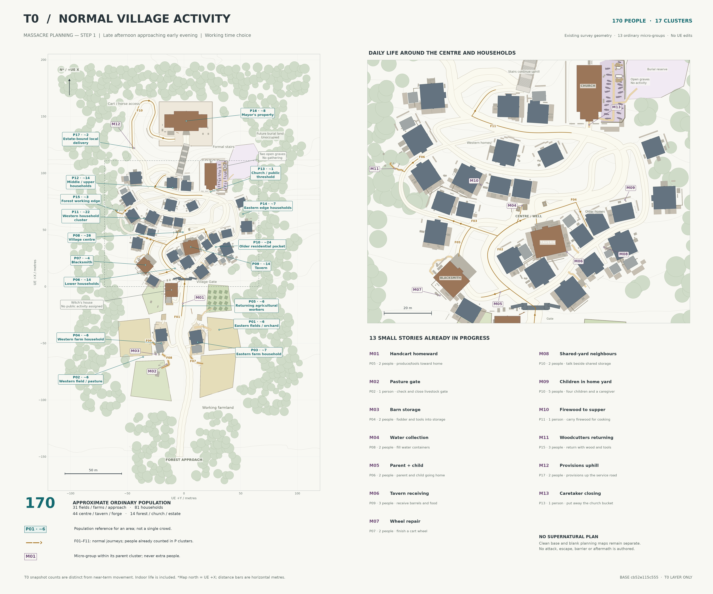

# T0 normal village activity

**MASSACRE PLANNING — STEP 1 / T0 NORMAL VILLAGE**

Authored **2026-09-09T13:08:04.376738+00:00**. Working time: **late afternoon approaching early evening**, not locked canon.

[Activity map](03_T0_normal_activity.png) · [Editable SVG](03_T0_normal_activity.svg) · [Activity data](t0_activity.json) · [Clean base](01_village_base_map.png) · [Clean planning copy](02_massacre_planning_blank.png)

## Summary

**Approximately 170 people in 17 clusters**, including indoor household life. The centre is busiest: 26 across its junction/frontages, with 14 more at the adjacent tavern. Families increasingly occupy homes and yards; agricultural work tapers without stopping everywhere. Water, fuel, tools and provisions move toward their ordinary destinations.

Each person belongs to one P cluster at T0. The 13 M micro-groups are **subsets**, never extra population. F arrows represent ordinary next journeys; some are underway, others follow completion of work. Destination counts describe current occupants and do not already include incoming travellers. This is a working allocation, not a finalized census or precise timetable.

The supplied **UE5 Roguelite – Village Hub & Witch Story, design bible v0.1, 9 September 2026** was read first. This layer follows its agrarian community, purposeful healthy baseline, small guard retinue and existing exhumation chronology. Its unresolved narrative questions remain unresolved. The Witch and supernatural actors receive no population allocation, position, activity or route here; animals are not counted.

## Where people are

31 in fields/farms/approach; 81 in household areas; 44 at centre/tavern/forge; 14 across forest/church/estate.

| Cluster | People | Ordinary activity |
|---|---:|---|

| P01 — Eastern fields / orchard | ~6 | Finish rows and gather tools/produce. |
| P02 — Western field / pasture | ~6 | Finish field work and settle livestock. |
| P03 — Eastern farm household | ~7 | Barn/yard work and farmhouse supper preparation. |
| P04 — Western farm household | ~6 | Fodder/tool storage and farmhouse work. |
| P05 — Returning agricultural workers | ~6 | Four heading home; two toward the tavern. |
| P06 — Lower households | ~14 | Eight indoors, four in yards, parent and child walking home. |
| P07 — Blacksmith | ~4 | Smith/apprentice finish a wheel; assistant tidies; one customer. |
| P08 — Village centre | ~26 | Four well users, six stall users/keepers, six neighbours talking, ten passing/collecting goods. |
| P09 — Tavern | ~14 | Three staff, ten early customers, one local delivery hand. |
| P10 — Older residential pocket | ~24 | Fourteen indoors, eight in shared yards, two in alleys across five households. |
| P11 — Western household cluster | ~22 | Fourteen indoors, six in yards, two moving between homes. |
| P12 — Middle / upper households | ~14 | Ten indoors, three in yards, one walking home. |
| P13 — Church / public threshold | ~1 | One caretaker finishes at the south public threshold. |
| P14 — Eastern edge households | ~7 | Four indoors; three tending yards/animals. |
| P15 — Forest working edge | ~3 | Three woodcutters returning with short wood and tools. |
| P16 — Mayor's property | ~8 | Mayor, three guards on ordinary property duties, four resident staff. |
| P17 — Estate-bound local delivery | ~2 | Local driver and helper taking provisions uphill. |

## Thirteen micro-groups

Detailed anchors, source prop/path IDs and activities are in the JSON. Counts below are already included above.

| ID / parent | People | Ordinary situation |
|---|---:|---|
| M01 / P05 | 2 | Farmer and helper bring produce/tools home by handcart on the approach. |
| M02 / P02 | 1 | Keeper checks and closes the existing pasture gate. |
| M03 / P04 | 2 | Two workers store fodder/tools beside the western barn and cart. |
| M04 / P08 | 2 | Two neighbours fill containers at the well. |
| M05 / P06 | 2 | Parent and child walk along Forge Lane toward the lower home/coop yard. |
| M06 / P09 | 3 | Two staff and the delivery hand receive barrels/food at the tavern service side. |
| M07 / P07 | 2 | Smith and apprentice finish a wheel beside the worktable/rack. |
| M08 / P10 | 2 | Two neighbours sort household items and talk beside shared storage. |
| M09 / P10 | 5 | Four children play a small game beside the family table; a caregiver works nearby. |
| M10 / P11 | 1 | A resident carries cooking wood from the existing household stack. |
| M11 / P15 | 3 | Three woodcutters return along the existing forest working trail. |
| M12 / P17 | 2 | Driver and helper use the switchback and service opening for provisions. |
| M13 / P13 | 1 | Caretaker puts away the church bucket and finishes near the public entrance. |

## Ordinary movements

| Flow | People already counted | Normal journey |
|---|---|---|
| F01 | ~4 from P05 | Fields and approach to lower homes |
| F02 | ~2 from P05 | Returning workers to tavern |
| F03 | ~2 from P08 | Well to western homes |
| F04 | ~3 from P08 | Centre to older homes |
| F05 | ~1 from P07 | Workshop to western home |
| F06 | ~3 from P15 | Forest crew to western yards |
| F07 | ~3 from P01 | Eastern field to barn |
| F08 | ~2 from P02 | Pasture to western farmyard |
| F09 | ~2 from P02 | Western field to barn storage |
| F10 | ~2 from P17 | Local delivery to estate service access |
| F11 | ~1 from P12 | Upper resident returning home |

F01/F02 split the same returning agricultural stream: four toward homes, two toward the tavern. The forge assistant leaves after tidying; the smith/apprentice remain working at the T0 instant. The estate delivery is already on the climb and uses cart access, never the stairs. The parent/child and firewood carrier also imply small domestic movements without adding more arrows. No flow is an escape attempt.

## Ordinary-day reasoning check

**Yes, as a working evening snapshot.** People gather water and cooking fuel, return from fields/forest, finish repairs, receive goods, prepare supper and begin tavern visits. These activities are anchored to existing useful spaces. No placement depends on a future attacker or convenient aftermath.

- **Centre:** 26 would be too crowded if treated as one well queue. They are deliberately distributed across the junction and frontages.
- **Older homes:** 24 across five households is plausible; only ten are outdoors. Children occupy the family-table yard, leaving the storage passage and roads clear.
- **Church:** one caretaker is enough without inventing a service/funeral. Both exhumed graves remain empty/open; nobody gathers there. The future burial land remains unoccupied.
- **Witch’s home:** domestic objects and herbs remain meaningful, but the lover and child are already dead. No intact-family gathering or remedy visitors are invented. The house’s quietness is consistent with the bible’s bereavement/isolation chronology.
- **Estate:** eight occupants across much larger grounds, plus two separately counted local delivery workers, convey the intended class contrast. Three guards fit the bible’s roughly 2–4.
- **Farmland:** 31 around agriculture/approach permits both finishing work and returning home. The compressed visible fields have not been proven sufficient to feed 170 people year-round; no extra geography or economic self-sufficiency claim is introduced.

## Geometry, editability and limits

This uses the existing **9 September 12:16:22 UTC** live survey. No UE scene edits, new scene captures or layout generation occurred. Up is UE +X; right is UE +Y. Distances are horizontal metres. P anchors identify areas, not a single crowd position.

`t0_activity.json` is a separate layer linked to the original geometry hash and feature IDs. Edit its counts, distributions, micro-groups and paths without touching the base. The SVG separates T0 population, ordinary movement and micro-groups; all future event layers are empty. `massacre_annotations.json` and both clean PNG/SVG pairs remain byte-for-byte unchanged.

Run `python render_t0.py .` here with NumPy, Matplotlib, Shapely and Pillow to render this sheet only. The script reuses the original drawing definitions without running their exports, validates population totals, and checks protected base hashes. The output is 6000 × 5000; `t0_manifest.json` records hashes and coordinate frames.

The 2D route traces and micro-group anchors clear projected building/older-outbuilding footprints. Short joins are under 1.25 m at existing frontages/junctions. This is not navmesh validation: eaves, small props, walls and thresholds still need player-height checks before implementation. F07 ends at the eastern yard gate before roof-obscured storage access. Indoor life and precise door movements remain conceptual.

**Stop at T0 for review. No Step 2, supernatural route, barrier, attack, death, destruction or aftermath has been authored.**
