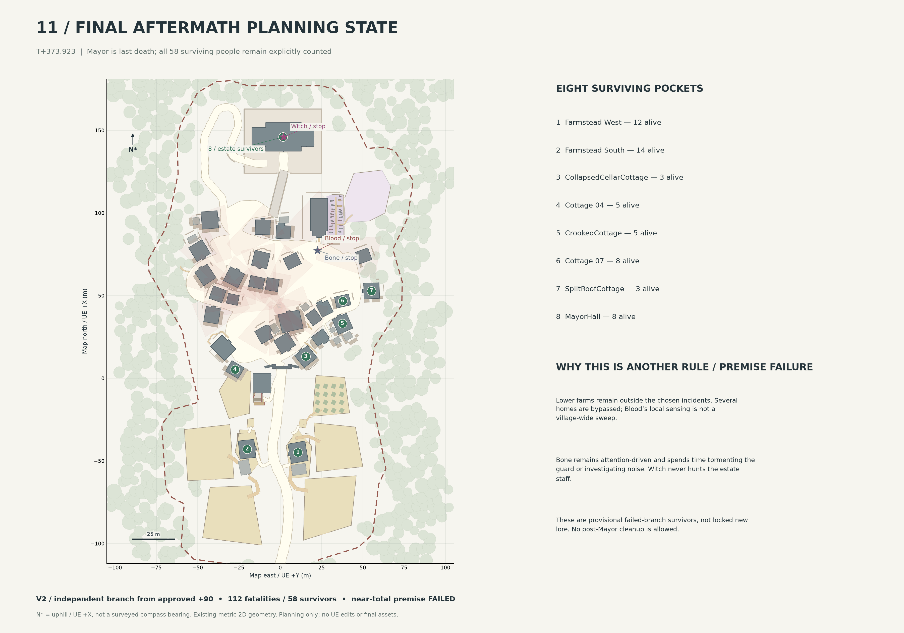

# MASSACRE SIMULATION V2 — RE-SIMULATED FROM T+90

**112 fatalities / 58 survivors / 0 injured survivors. Near-total premise: FAILED.** Witch reaches Mayor at +313.923, secures him for sixty seconds and kills him last at +373.923. No post-terminal cleanup. No UE edits.

Start with the [chronological summary, every event/cycle, survivor reasons and V1 comparison](MASSACRE_V2_FULL_SIMULATION.md).

## Review sheets

| Sheet | PNG | Editable SVG |
| --- | --- | --- |
| Full chronological map | [PNG](01_v2_full_chronology.png) | [SVG](01_v2_full_chronology.svg) |
| Blood incidents / paths | [PNG](02_v2_blood_incidents.png) | [SVG](02_v2_blood_incidents.svg) |
| Blood resource / power growth | [PNG](03_v2_blood_power_growth.png) | [SVG](03_v2_blood_power_growth.svg) |
| Bone attention pattern | [PNG](04_v2_bone_pattern.png) | [SVG](04_v2_bone_pattern.svg) |
| Bone / son-killer guard | [PNG](05_v2_bone_guard_sequence.png) | [SVG](05_v2_bone_guard_sequence.svg) |
| Witch route / elevation | [PNG](06_v2_witch_route.png) | [SVG](06_v2_witch_route.svg) |
| Arrival / final minute | [PNG](07_v2_mayor_final_minute.png) | [SVG](07_v2_mayor_final_minute.svg) |
| Executed civilian movement | [PNG](08_v2_civilian_movement.png) | [SVG](08_v2_civilian_movement.svg) |
| Barrier contact / knowledge | [PNG](09_v2_barrier_knowledge.png) | [SVG](09_v2_barrier_knowledge.svg) |
| Casualty progression | [PNG](10_v2_casualty_progression.png) | [SVG](10_v2_casualty_progression.svg) |
| Final aftermath / survivors | [PNG](11_v2_final_aftermath.png) | [SVG](11_v2_final_aftermath.svg) |
| Environmental story seeds | [PNG](12_v2_story_seeds.png) | [SVG](12_v2_story_seeds.svg) |

## Orientation, scale and provenance

North is uphill / UE +X; east is UE +Y. Coordinates and bars are metres, not a surveyed compass bearing. The existing 09 September healthy-scene orthographic geometry is projected without redesign. Road/building/property/field/forest outlines are preserved. Barrier and events are separate 2D annotations, not UE edits.

Sheets use different crop extents. Whole-clearing sheets include the approach barrier contact; detail sheets intentionally crop distant farmland. Numbered incidents share a marker when locations coincide. Blood markers use exposed-group centroids when casualties occur; event JSON xy is the attacker origin. Wave polygons are exposure requirements, not debris. Blue short dashed lines are Bone bursts, not a systematic route. Green circles are provisional survivors, not guaranteed safe areas. Grey buildings, cream roads, tan farmland and green forest retain the base categories.

The [base](../01_village_base_map.png), [clean canvas](../02_massacre_planning_blank.png), [T0](../03_T0_normal_activity.png), [T1](../t1_simulation.json) and [Bone completion](../bone_completion.json) remain unchanged. V1 files remain in the parent directory, historical and non-canon after +90 for V2.

## Editability

- v2_simulation.json: closed branch, people, events, movement, knowledge, sources/draws, snapshots and seeds.
- v2_actions.jsonl / v2_reactions.jsonl: 157 separate editable phase pairs, one object per line. Cycle number is the one-based row. No hundreds of redundant snapshots.
- CSVs: individual casualties/survivors, events, movement, knowledge and power.
- v2_handoff_90.json / v2_initial_state.json / v2_rules.json: independent start and working parameters.
- render_v2.py: offline presentation only. Run python render_v2.py beside these files; parent map_data.json is unchanged. Requires NumPy, Matplotlib, Shapely, Pillow. SVG text/paths remain editable.
- engine_v2.py / spatial_v2.py / pulse_v2.py: small offline planning harness. For inspection/replay copy them to a **separate scratch directory**, put parent map_data.json in scratch inputs/ and handoff/rules JSON in scratch package/. Run python engine_v2.py init, then python engine_v2.py step for one pair. python pulse_v2.py 12 runs a bounded window stopping at a major event. Inspect every boundary. This produces a scratch experiment, not permission to overwrite or extend closed V2.

No UE source/assets, raw actor dumps, DOCX source, Blender, builds or caches are included. No map is an AI-redrawn village.

## Limits and validation

2D roofs, approximate doors/interiors, distance-based sound, planning speeds, subjective attention and working blood thresholds are abstractions. This is not a uniquely validated physical outcome. Fifty-eight survivors explicitly fail near-total loss. The extra minute is independent of population. Dialogue/cinematic method and later barrier/Witch fate remain open.

See v2_validation.json, v2_preservation.json, v2_amplification_diagnostic.json and v2_manifest.json. Publication is authorized review sharing only.
